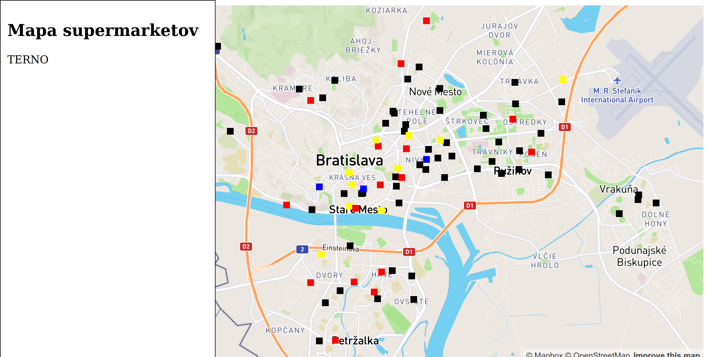

# A GIS project demo: supermarket visualisation

This is a small project that shows you how easy it is to create a simple
application working with GIS data.  It shows a map with dots, representing
supermarkets. Each dot is color-coded to visually represent the particular
supermarket brand (e.g., blue for Tesco, yellow for Billa, red for Terno, etc.)

The application looks like this:



Keep in mind that this is not the level your project is expected to be at.

## Importing data

This project is using data from OSM, here's how to import it:

1. Open OSM http://www.openstreetmap.org/export#map=14/48.1323/17.0958 and position the viewport to include area you want to download.
2. Click the green Export button and in the panel that opens on the left side. The official OSM servers offer only very limited export size, you may need to use a mirror, e.g. the Overpass API. Just click the mirror name in the left panel and save the file to local disk.
3. The downloaded data will be in XML format and we'll need to convert it to SQL. Install osm2pgsql tool from http://wiki.openstreetmap.org/wiki/Osm2pgsql. Many Linux distributions include this tool in official repositories so you can install it using your distribution's standard package manager. E.g., on Ubuntu, use `sudo apt install osm2pgsql`.
4. Inspect the downloaded file. What you get will depend on the mirror you used, but it's important that you end up with uncompressed XML with .osm extension. In my case the downloaded file was called `map` (with no extension). Let's inspect what it is.
```
$ file map
map: OpenStreetMap XML data
```
In this case we got uncompressed XML, so just rename it
````
$ mv map map.osm
````
5. Prepare the database. First install PostGIS extension http://postgis.net/install/. If you are using the `fiitpdt/postgis` docker image, you can skip this step.
6. Connect to your database, e.g. `psql -H localhost -u postgres`. Create the database (we'll use `gisproject` as a name): run a SQL command `create database gisproject` as the administrative postgres user. Connect to the newly created database and run `create extension postgis` which will enable PostGIS for the database.
7. Run `osm2pgsql`
````
$ osm2pgsql -m -U postgres -H localhost map.osm

osm2pgsql version 0.92.0 (64 bit id space)

Using built-in tag processing pipeline
Using projection SRS 3857 (Spherical Mercator)
Setting up table: planet_osm_point
Setting up table: planet_osm_line
Setting up table: planet_osm_polygon
Setting up table: planet_osm_roads
Allocating memory for dense node cache
Allocating dense node cache in one big chunk
Allocating memory for sparse node cache
Sharing dense sparse

[more output...]

All indexes on planet_osm_line created in 1s
Completed planet_osm_line

Osm2pgsql took 3s overall

````

## Project structure

There are only few important code files:

- `app/views/maps/show.html.erb` - the frontend client, which shows the map and calls the backend APIs to get supermarket data.
- `app/controllers/supermarkets_controller.rb` - which represents the `/supermarkets.json` API - it runs the database queries and generates the JSON response.
- `app/models/supermarket.rb` - contains the SQL query which pulls the supermarket data from the dabase.


## Useful links

- [MapBox JavaScript SDK documentation](https://docs.mapbox.com/mapbox-gl-js/api/)
- [MapBox JavaScript SDK examples](https://docs.mapbox.com/mapbox-gl-js/examples/)
